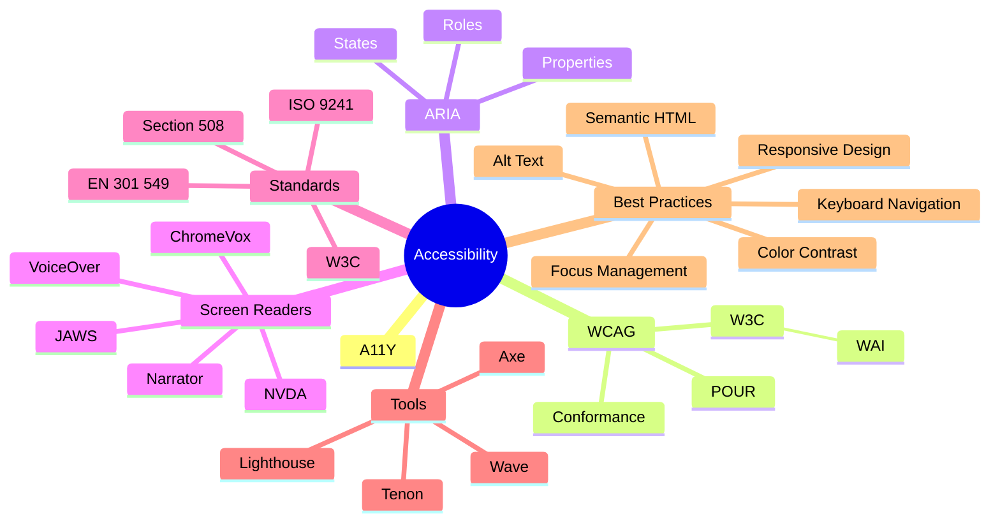

---
title: A11Y Terms
---



---
layout: full
title: What does A11Y mean?
---

<div class="text-center h-full flex flex-col items-center justify-center gap-12">

  <p class="text-9xl text-yellow">A<span class="text-red">11</span>Y</p>

  <table class="table-auto" v-click>
    <thead class="text-3xl">
      <tr class="text-red">
        <td class="text-yellow">a</td>
        <td>c</td>
        <td>c</td>
        <td>e</td>
        <td>s</td>
        <td>s</td>
        <td>i</td>
        <td>b</td>
        <td>i</td>
        <td>l</td>
        <td>i</td>
        <td>t</td>
        <td class="text-yellow">y</td>
      </tr>
    </thead>
    <tbody>
      <tr class="text-sm">
        <td>-</td>
        <td>1</td>
        <td>2</td>
        <td>3</td>
        <td>4</td>
        <td>5</td>
        <td>6</td>
        <td>7</td>
        <td>8</td>
        <td>9</td>
        <td>10</td>
        <td>11</td>
        <td>-</td>
      </tr>
    </tbody>
  </table>
</div>

<style>
.slidev-vclick-target {
  @apply opacity-100;
  transition: opacity 250ms ease-out;
}

.slidev-vclick-target.slidev-vclick-target-active {
  @apply opacity-0;
}
</style>

---

# Why are we here?

<v-clicks>

EAA (European Accessibility Act)

## What are the guidelines

WCAG 2.1

## What are the requirements?

<v-clicks at="5">

1. Perceivable
2. Operable
3. Understandable
4. Robust

</v-clicks>

</v-clicks>

---

# What do those mean?

<div class="grid grid-cols-4 text-[6px]">

<v-clicks>

<div>

### Perceivable

1. Text Alternatives
  1. Non-text Content
2. Time-based Media
  1. Audio-only and Video-only (Prerecorded)
  2. Captions (Prerecorded)
  3. Audio Description or Media Alternative (Prerecorded)
  4. Captions (Live)
  5. Audio Description (Prerecorded)
  6. Sign Language (Prerecorded)
  7. Extended Audio Description (Prerecorded)
  8. Media Alternative (Prerecorded)
  9. Audio-only (Live)
3. Adaptable
  1. Info and Relationships
  2. Meaningful Sequence
  3. Sensory Characteristics
  4. Orientation
  5. Identify Input Purpose
  6. Identify Purpose
4. Distinguishable
   1. Use of Color
   2. Audio Control
   3. Contrast (Minimum)
   4. Resize Text
   5. Images of Text
   6. Contrast (Enhanced)
   7. Low or No Background Audio
   8. Visual Presentation
   9. Images of Text (No Exception)
   10. Reflow
   11. Non-text Contrast
   12. Text Spacing
   13. Content on Hover or Focus

</div>

<div>

### Operable

</div>

<div>

### Understandable

1. Readable
  1. Language of Page
  1. Language of Parts
  2. Unusual Words
  3. Abbreviations
  4. Reading Level
  5. Pronunciation
2Predictable
2.1On Focus
2.2On Input
2.3Consistent Navigation
2.4Consistent Identification
2.5Change on Request
2.6Consistent Help
3Input Assistance
3.3.1Error Identification
3.3.2Labels or Instructions
3.3.3Error Suggestion
3.3.4Error Prevention (Legal, Financial, Data)
3.3.5Help
3.3.6Error Prevention (All)
3.3.7Redundant Entry
3.3.8Accessible Authentication (Minimum)
3.3.9Accessible Authentication (Enhanced)

</div>

<div>

### Robust

1. Compatible
   1. Parsing (Obsolete and removed)
   2. Name, Role, Value
   3. Status Messages

</div>

</v-clicks>

</div>

---

# Which page is better for accessibility?

https://broken-workshop.dequelabs.com/

-- or --

https://demo.cardan.com/english/

---

# Who gets it right?

<!-- Add an example of a good website for a11y -->


---

# Testing

<!-- Figma, pipelines, extensions, storybook -->

<!-- Talk about the automated testing, finish by saying that it's not enough -->

---

# But Automated testing doesn't catch everything

<!-- add video of the scrolling -->
<!-- add video of the app -->
<!-- add video of the toast -->

---

# How do I manually test

<!-- Manual testing can be different for developers and designers. -->
<!-- Of course the best way to test is to use the tools that people use -->
<!-- For example, screen readers, just using the keyboard, zoom testing -->

---

# ============= LUNCH =========== 🍤

---

# How can I see if it's accessible? (as a developer)

<!-- You can see how the HTML links to the a11y tree -->

<div class="grid grid-cols-2 gap-4">

```yml {*|1|2|3|4|5|6|7|8|*|*|1|2|3|4|5|6|7|8|*}{at:1}
- generic
  - heading "INACCESSIBLE WEB DESIGN"
  - Staticlext "TNACCESSTRIE"
  - StaticText "WEB DESIGN"
  - heading "Exclude We'll just do it!"
    - StaticText "Exclude"
    - strong ""
      - StaticText "We'll just do it!"
```

<div class="flex flex-col gap-2">

````md magic-move

```html {*|1,10|2-5|3|4|6-9|7|8|8|*}{at:1}
<div class="banner-text">
  <h1 class=" poppins-extrabold">
    <span>Inaccessible</span> 
    Web Design
  </h1>
  <h2>
    Exclude
    <strong>We'll just do it!</strong>
  </h2>
</div>
```

<!-- Something neet is that the `pug` language looks quite a lot like the a11y tree -->

```pug {*|1|2-4|3|4|5-6|5|6|6|*}{at:12}
.banner-text
  h1.poppins-extrabold
    span Inaccessible
    | Web Design
  h2 Exclude
    strong We'll just do it!
```

````

</div>

</div>

---

# How do I make it accessible?

The route to easier accessibility

<v-clicks>

1. Use Native HTML (semantic HTML)
2. Use Aria roles
3. Use Aria attributes

</v-clicks>

---
layout: two-cols-header
---

# Why do we use semantic HTML?

::left::

<v-switch>

<template #1>

<v-clicks at="1">

<!-- These are just side effects that we get for free when we care about a11y -->

## Added benefits
- Semantic HTML is easier to read / parse
- Semantic HTML is easier to maintain
- Semantic HTML is easier to style

</v-clicks>

</template>

<template #5>

It gives you functionality for free 

```yaml
- banner
 - StaticText "DopeSite"
  - navigation
    - list
      - listitem
        - link "Home" focusable: true url: /
      - listitem
        - link "About" focusable: true url: /about
      - listitem
        - link "Products" focusable: true url: /products
- main ""
  - heading "Look at how cool my website is!"
    - StaticText "Look at how cool my website is!"
  - paragraph ""
  - StaticText "it's like a short-cut to better code"
- contentinfo ""
  - StaticText "Look at all of this boring footer stuff"
```

</template>

<template #6>

</template>

</v-switch>

::right::

````md magic-move {at: 1}

```html
<body>
  <!-- START HEADER -->
  <div class="header">
    <div class="brand">DopeSite</div>
    <div class="nav">
      <a href="/" class="current">Home</a>
      <a href="/about">About</a>
      <a href="/products">Products</a>
    </div>
  </div>
  <!-- END HEADER -->
  <!-- START MAIN -->
  <div class="main">
    <div class="page-title">Look at how cool my website is!</div>
    <div class="content">
      <div class="text">it's like a short-cut to better code</div>
    </div>
  </div>
  <!-- END MAIN -->
  <!-- START FOOTER -->
  <div class="footer">
    <div>Look at all of this boring footer stuff</div>
    <div>Click for Party</div>
  </div>
  <!-- END FOOTER -->
</body>
```

```html
<body>
  <!-- START HEADER -->
  <header class="header">
    <div class="brand">DopeSite</div>
    <nav class="nav">
      <ul>
        <li><a href="/" class="current">Home</a></li>
        <li><a href="/about">About</a></li>
        <li><a href="/products">Products</a></li>
      </ul>
    </nav>
  </header>
  <!-- END HEADER -->
  <!-- START MAIN -->
  <main class="main">
    <h1 class="page-title">Look at how cool my website is!</h1>
    <div class="content">
      <p class="text">it's like a short-cut to better code</p>
      <div role="button">Click for Party</div>
    </div>
  </main>
  <!-- END MAIN -->
  <!-- START FOOTER -->
  <footer class="footer">
    <div>Look at all of this boring footer stuff</div>
  </footer>
  <!-- END FOOTER -->
</body>
```

```html
<body>
  <header class="header">
    <div class="brand">DopeSite</div>
    <nav class="nav">
      <ul>
        <li><a href="/" class="current">Home</a></li>
        <li><a href="/about">About</a></li>
        <li><a href="/products">Products</a></li>
      </ul>
    </nav>
  </header>
  <main class="main">
    <h1 class="page-title">Look at how cool my website is!</h1>
    <div class="content">
      <p class="text">it's like a short-cut to better code</p>
      <div role="button">Click for Party</div>
    </div>
  </main>
  <footer class="footer">
    <div>Look at all of this boring footer stuff</div>
  </footer>
</body>
```

```html {*|*|*|6}
<body>
  <header>
    <div>DopeSite</div>
    <nav>
      <ul>
        <li><a href="/">Home</a></li>
        <li><a href="/about">About</a></li>
        <li><a href="/products">Products</a></li>
      </ul>
    </nav>
  </header>
  <main>
    <h1>Look at how cool my website is!</h1>
    <div>
      <p>it's like a short-cut to better code</p>
      <button>Click for Party</button>
    </div>
  </main>
  <footer>
    <div>Look at all of this boring footer stuff</div>
  </footer>
</body>
```

````

---

# But we use components!

````md magic-move {at: 1}
```tsx
import { Select } from "react-select";

return (
  <Select
    options={options}
    onChange={handleChange}
    value={selectedOption}
  />
)
```

```tsx
import { Select } from "react-select"; // 89.07KB (30.31KB zipped) 

return (
  <Select
    options={options}
    onChange={handleChange}
    value={selectedOption}
  />
)
```
````

````md magic-move {at: 2}
```tsx
return (
  <select value={selectedOption}>
    {options.map(({ value, friendlyName }) => (
      <option value={value}>{friendlyName}</option>
    ))}
  </select>
);
```

```tsx
return (  // It's FREE!
  <select value={selectedOption}>
    {options.map(({ value, friendlyName }) => (
      <option value={value}>{friendlyName}</option>
    ))}
  </select>
);
```

```tsx
return (
  <datalist value={selectedOption}>
    {options.map(({ value, friendlyName }) => (
      <option value={value}>{friendlyName}</option>
    ))}
  </datalist>
);
```
````
<!-- This is when you have the ability to use the html components -->

---

# But the component I want to make isn't there...

<!-- In that case, you can use Aria roles -->

## Aria Roles


<!-- If you can't do it with aria roles, then you have to get more creative -->

---

## Aria Attributes

Accessible Rich Internet Applications

<!-- https://www.w3.org/TR/using-aria/ -->


---

# Recap


---
